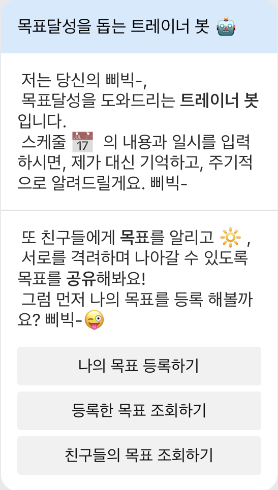
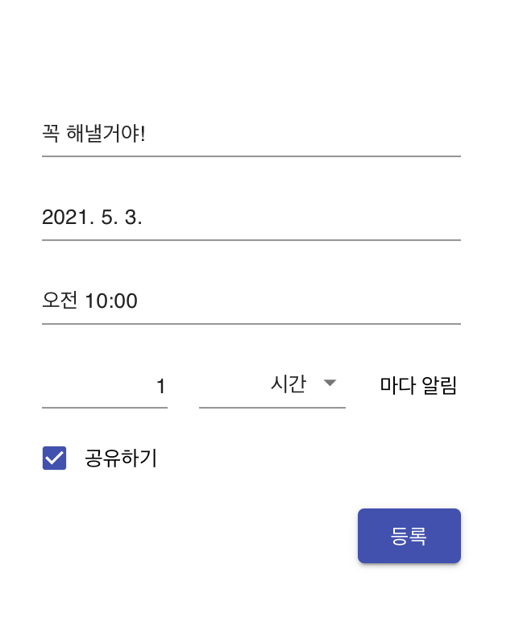

# 당신만의 목표달성 트레이너 봇 🤖

*SW maestro mini-project 5팀, TMSM*

## 왜 목표달성 챗봇 인가요?

1. 머릿속으로 생각해 놓은 목표를 잊어버리신 적 있나요?
2. 목표달성 데드라인을 지속적으로 상기시키고 싶으신가요?
3. 친구, 동료들에게 나의 목표를 알리고 실천하고 싶으신가요?
   
**그렇다면 잘 찾아오셨습니다, 저는 당신의 목표달성을 잊지 않도록 상기시켜주는 트레이너 봇 입니다.**

****
## 사용방법
1. 목표등록 버튼을 누르시고, **목표**를 등록 해주세요.  
    - 목표 등록은 다음과 같이 구성 되어 있어요.  
       * 달성하고자 하는 목표를 먼저 입력하고,
       * **데드라인** 일시를 입력해주세요.
       * 얼마나 **주기적**으로 푸시를 받을 것인지,
       * 또 친구들과 **공유**하기 버튼을 통해, 함께 달성해 나가요!
2. **등록한 목표 조회** 버튼으로 내가 등록한 목표를 조회할 수 있어요.
3. **친구들의 목표 조회** 버튼으로 공유한 목표를 확인 할 수 있어요.
   

 

****
## 만든 사람들

### Frontend
* **노기진, 오연우**
   * React
### Backend
* **곽병곤, 최준영**
  * Node.js, express, ...
### DB
* **김예슬**
  * MYSQL
### ETC
* **황성현**
****

## License

see the [LICENSE.md](LICENSE.md)
****
